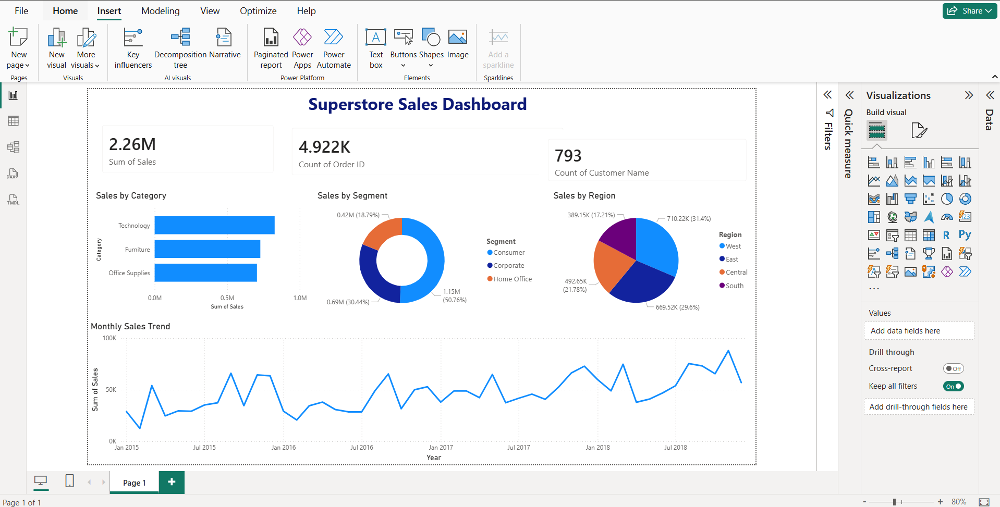

# Superstore Sales Power BI Dashboard

## Project Overview
An interactive Power BI dashboard analyzing 4 years (2015–2018) of superstore 
sales data to uncover key business insights across regions, product categories, 
and customer segments.

## Dashboard Preview

## Dataset
- **Source:** [Kaggle — Superstore Sales Dataset](https://www.kaggle.com)
- **Records:** 9,800 rows
- **Time Period:** 2015 – 2018
- **Fields:** Order Date, Ship Mode, Customer Name, Segment, Region, 
  Category, Sub-Category, Product Name, Sales

## Tools Used
- Microsoft Power BI Desktop
- DAX (Data Analysis Expressions)
- Power Query

## Dashboard Features
- **Total Sales KPI Card** — $2.26M total revenue
- **Total Orders KPI Card** — 4,922 unique orders
- **Total Customers KPI Card** — 793 unique customers
- **Sales by Category** — horizontal bar chart comparing 
  Technology, Furniture, and Office Supplies
- **Sales by Segment** — donut chart showing Consumer (50.76%), 
  Corporate (30.44%), and Home Office (18.79%) breakdown
- **Sales by Region** — pie chart showing West (31.4%) leads all regions
- **Monthly Sales Trend** — line chart showing sales growth 
  from 2015 to 2018 with seasonal peaks every November

## Key Findings
- Total sales reached **$2.26M** across 4,922 orders from 793 customers
- **Technology** was the top selling category at $827,455
- **West region** led all regions at $710,220 (31.4% of total sales)
- **Consumer segment** dominated at 50.76% of total sales
- **November consistently** had the highest monthly sales across all 
  4 years indicating strong seasonal demand
- Sales showed a clear **upward trend** from 2015 to 2018

## What I Learned
- Building interactive dashboards in Microsoft Power BI Desktop
- Creating KPI cards, bar charts, donut charts, pie charts, 
  and line charts
- Formatting and designing professional dashboard layouts
- Connecting and transforming data using Power Query
- Analyzing business data to extract meaningful insights
